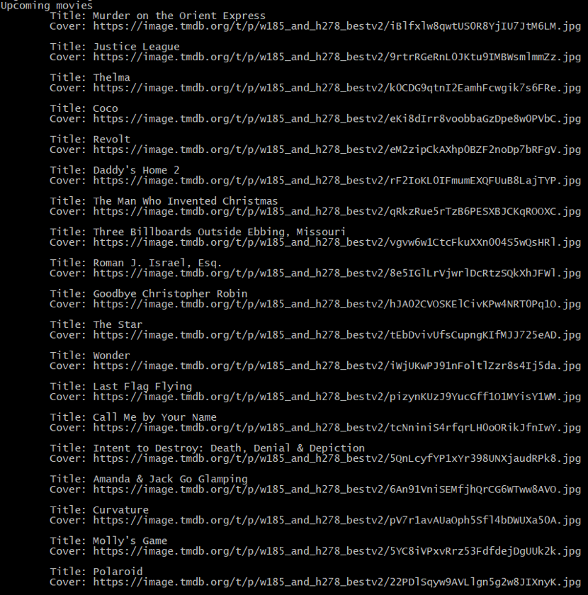

# themoviedb

Library to get movies & tv airing today.

## Methods

| Method | Description |
| ------ | ----------- |
| GetPopularMovies() | What are the most popular movies? |
| GetUpcomingMovies() | What are the upcoming movies? |
| GetTopRatedMovies() | What are the top rated movies? |
| GetNowPlayingMovies() | What movies are in theatres? |
| GetPopularTVShows() | What are the most popular tv shows? |
| GetTopRatedShows() | What are the top rated tv shows? |
| GetOnTVShows() | What tv shows are on tv? |
| GetAiringTodayShows() | What are the tv shows airing today? |

## Install

```
go get -u github.com/mlabouardy/moviedb
```

## Examples

To get list of upcoming movies:

```
func main() {
	db := NewMovieDB()
	fmt.Println("Upcoming movies")
	for _, show := range db.GetUpcomingMovies() {
		fmt.Printf("\tTitle: %s\n\tCover: %s\n\n", show.Title, show.Cover)
	}
}
```
<div align="center">
  
</div>

## Tutorials

* [Generate beautiful Swagger Documentation from Insomnia](http://www.blog.labouardy.com/generate-swagger-documentation-from-insomnia-rest-client/)

## Maintainers

- Mohamed Labouardy - mohamed@labouardy.com

## License

This project is licensed under the MIT License - see the [LICENSE](LICENSE) file for details
